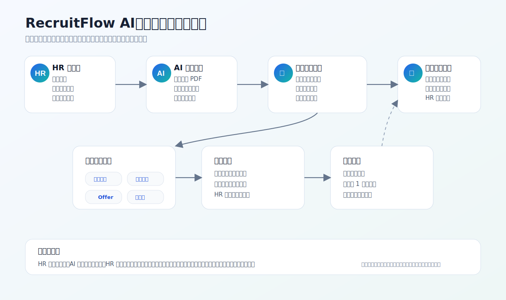
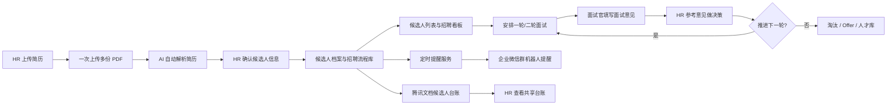

# RecruitFlow AI 架构图

这张图按 HR 的日常工作流来理解：系统把“看简历、登记台账、推进面试、提醒跟进”串成一条自动化流程。

## 业务流程图

## HR 视角说明

- **上传简历**：HR 可以一次上传多份 PDF，系统按顺序解析，先解析好的先进入确认区。
- **AI 解析**：系统自动提取姓名、电话、学校、专业、技能、项目经历等信息。
- **去重保存**：如果候选人已经存在，系统更新已有记录，避免同一个人反复出现在台账里。
- **流程推进**：HR 可以维护一轮面试、二轮面试、Offer 发放等阶段。
- **面试官意见**：每个面试官都有独立意见输入框，意见保存在系统里，暂不写入腾讯文档。
- **腾讯文档台账**：保存后同步候选人关键字段，方便 HR 在腾讯文档中查看共享数据。
- **企业微信提醒**：配置群机器人后，系统会发送今日面试汇总和面试前 1 小时提醒。

## 系统模块说明

| 模块 | 作用 | HR 能看到的结果 |
| --- | --- | --- |
| 简历上传与解析 | 自动读取 PDF 并调用 AI 解析 | 候选人信息自动填好 |
| 候选人档案库 | 保存候选人基础信息并做去重 | 不重复登记同一个人 |
| 招聘流程管理 | 记录阶段、状态、面试时间、HR 决策 | 一轮、二轮、Offer 流程清晰 |
| 面试官意见 | 按面试官姓名保存评价 | HR 决策前能看反馈 |
| 腾讯文档同步 | 把候选人台账写到在线表格 | 共享查看、可对外展示 |
| 企业微信提醒 | 定时推送面试提醒 | 群里收到提醒消息 |
| 招聘看板 | 汇总候选人和面试数据 | 快速看招聘进展 |

## 数据流向

1. HR 上传简历。
2. 系统自动解析并生成候选人确认表。
3. HR 确认后保存到系统数据库。
4. 系统把候选人关键字段同步到腾讯文档。
5. 面试流程变化时，系统更新同一条候选人记录。
6. 面试前，系统按时间自动发送企业微信群提醒。
